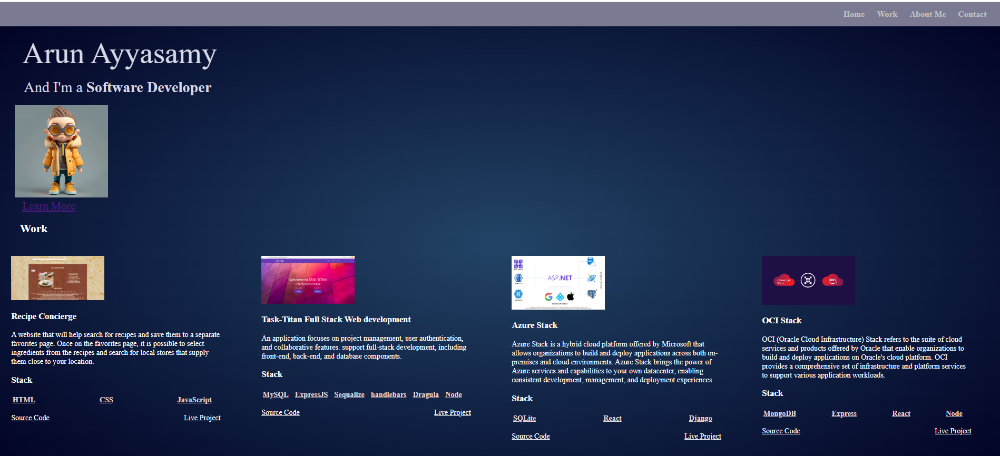

# myPortfolio.1.x

## Advanced CSS: Portfolio

## Objective:

Build a portfolio to showcasing skills and expertise to demonstrate abilities, talents, and expertise in a tangible way. It provides evidence of the past work and projects, giving potential clients or employers a clear understanding of what i can bring to the table.

## User Story: 

AS AN employer I WANT to view a potential employee's deployed portfolio of work samples SO THAT I can review samples of their work and assess whether they're a good candidate for an open position

## Tasks Completed:

Created the GIT repository named myPortfolio.1.x

Created a index.html with meta name="viewport" content="width=device-width, initial-scale=1"

To include a hyperlink (a link) on my portfolio page, used the HTML <a> tag with the nav section which has sections for Home, Work, About Me and Contact

Created a section with images of applications that i built

Added a contact section that has ways to get ahold of me through an email

Pushed the code the repository myPortfolio.1.x

Hosted the index.html in GitHub Pages

## Links

URL to the GitHub repository: https://github.com/arundvp/myPortfolio.1.x

URL to my deployed webpage: https://arundvp.github.io/myPortfolio.1.x/#home

